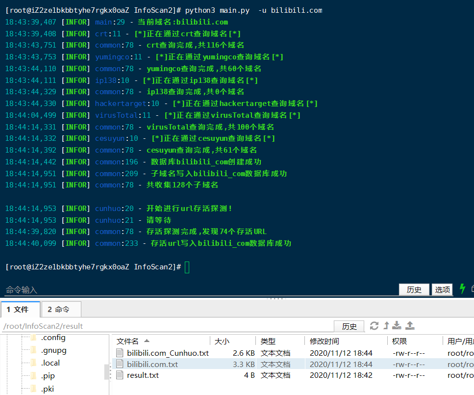

# InfoScan2
一个web信息收集工具，包括子域名收集，在之前的infoscan上进行了修改，去除了子域名爆破功能，增加了域名存活判断，waf检测和js爬取功能。挖掘SRC的小工具
# 使用方法
## 配置数据库
在config.py里面设置数据库账号和密码，并提前创建数据库

## 单个域名
### 自动收集域名并进行存活判断，结果写入数据库并导出文件到result文件下
> python3 mian.py -u xxxx.xxxx.xxx
### 自动收集域名并进行存活判断和waf检测，结果写入数据库并导出文件到result文件下
> python3 mian.py -u xxxx.xxxx.xxx -w
### 自动收集域名并进行存活判断和js深度爬取，结果写入数据库并导出文件到result文件下
> python3 mian.py -u xxxx.xxxx.xxx -j
### 自动收集域名并进行存活判断和存活判断、js深度爬取，结果写入数据库并导出文件到result文件下
> python3 mian.py -u xxxx.xxxx.xxx -w -j
## 批量
> 将-u xxx.xxx.xxx换为-f target_sub.txt，一行一个域名

